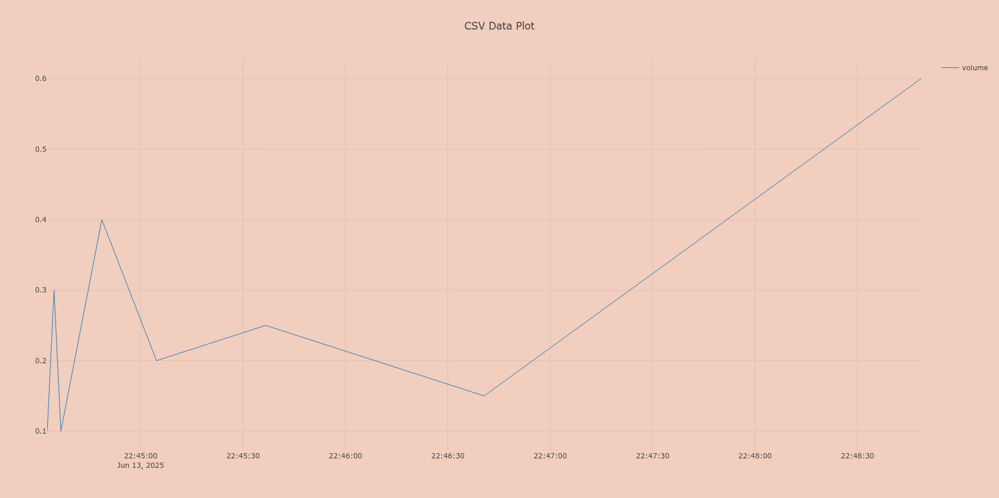
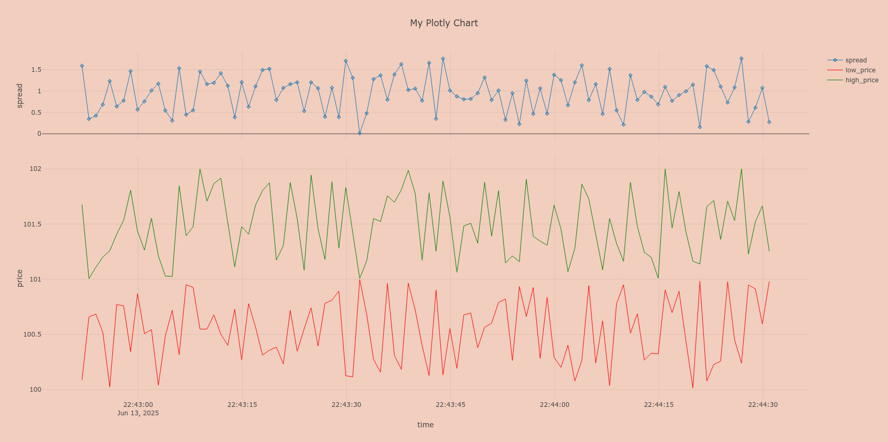

# plotly-spark

**plotly-spark** is a lightweight, extensible visualization tool designed for the Apache Spark Java API. 
It bridges the gap between Spark SQL DataFrames and interactive plotting by providing a simple, 
yet powerful way to visualize data using [PlotlyJs](https://plotly.com/javascript/).

### How does it work?

**plotly-spark** packages a predefined HTML template and Javascript function, 
which is customized with user's context. The final page is rendered with
[Pebble Engine](https://pebbletemplates.io/wiki/guide/basic-usage/). In the background it 
embeds [Dataframe](https://spark.apache.org/docs/latest/sql-programming-guide.html) as CSV data. 

### Why plotly-spark?

While Spark's Java API is powerful for large-scale data processing, it lacks native, 
convenient support for visual exploration of data—especially compared to Python. 

`plotly-spark` fills this gap by:

- Offering an easy way to plot Spark SQL DataFrames directly in your browser
- Providing a clear, minimal API tailored for Java developers
- Supporting extensibility for custom layouts, styles, and multiple traces

### Features

- 📈 Full inter-operability with Plotly.js-based visualizations
- 🔌 Works with Spark SQL DataFrames out of the box
- 🛠️ Simple API designed for Java developers
- ⚙️ Customizable and extensible layout and trace options

### Example Usage

* [A simple scatter plot](./src/main/java/examples/SimpleScatterExample.java)
```java
Plotly.instance()
    //plug in Dataframe
    .data(
        Data.builder()
            .session(spark)
            .df(df)
            .build()
    )
    // configure X and Y axis
    .figure(Figure.builder()
        .xAxisLabel("timestamp")
        .yAxisLabel("volume")
        .build()
    )
    // specify where to save rendered HTML
    .output(Output.builder()
        .renderInBrowser(true)
        .pathToOutputFolder(new File("./target/testoutput"))
        .outputFilename("my_plot")
        .build()
    )
    .show();
```


* [Multiple Scatter and Subplots](./src/main/java/examples/MultipleScattersExample.java)
```java
Plotly.instance()
    .data(
        Data.builder()
            .session(spark)
            .df(df)
            .build()
    )
    .figure(Figure.builder()
        .xAxisLabel("timestamp")
        .yAxisLabel("spread")
        .yAxisLabel("low_price")
        .yAxisLabel("high_price")
        // create two coupled plots
        .layoutOverrides(
            """
              { 
                "title": { "text": "My Plotly Chart"},
                "xaxis": { "title": { "text": "time" }},
                "yaxis": { 
                  "title": { 
                    "text": "price" 
                  },
                  "domain": [0.00, 0.70]
                },
                 "yaxis2": { 
                  "title": { 
                    "text": "spread" 
                  },
                  "domain": [0.75, 1.00]
                },
                "grid": {
                  "rows": 2,
                  "columns": 1,
                  "roworder": "bottom to top",
                  "pattern": "coupled"
                }
              }
            """
        )
        .traceOverrides(
            """
              [
               {
                 "name": "spread",
                 "mode": "lines+markers",
                 "marker": {
                   "symbol": "cross-open",
                   "size" : 5
                 },
                 "xaxis": "x",
                 "yaxis": "y2"
               },
               {
                 "name": "low_price",
                 "line": {
                   "color": "red",
                   "width": 1.0
                 }
               },
               {
                 "name": "high_price",
                 "line": {
                   "color": "green",
                   "width": 1.0
                 }
               }
              ]
            """
        )
        .build()
    )
    .output(Output.builder()
        .renderInBrowser(true)
        .pathToOutputFolder(new File("./target/testoutput"))
        .outputFilename("my_plot")
        .build()
    )
    .show();
```
